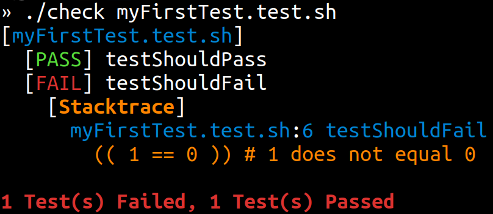

[/badge.svg)](https://github.com/specs-sh/check/actions?query=workflow%3A%22Mac+%28BASH+3.2%29%22) [](https://github.com/specs-sh/check/actions?query=workflow%3A%22BASH+4.0%22) [](https://github.com/specs-sh/check/actions?query=workflow%3A%22BASH+4.4%22) [](https://github.com/specs-sh/check/actions?query=workflow%3A%22BASH+5.0%22)

# ☑️ `$ check`

> Tiny Shell Script Test Framework ( < 50 LOC)
>
> 📖 https://check.specs.sh _for full documentation_

---

- Supports Mac OS X default BASH version (`3.2.57`)
- Supports modern BASH versions (`4.0`, `4.4`, `5.0`)
- Customizable ( _create custom formatters or even change the test syntax!_ )

### Install

```sh
curl -o- https://check.shellbox.sh/install.sh | bash
```

> or download the [latest release](https://github.com/specs-sh/check/releases)

### Example Test

```sh
setup() {
  # Some setup code that runs before each test
  # Supports multiple setup blocks:
  # » any function starting with 'setup' or 'before' (case-insensitive)
}

teardown() {
  # Some code that runs after each test, even if it fails.
  # Supports multiple teardown blocks:
  # » any function starting with 'teardown' or 'after' (case-insensitive)
}

# Any function which starts with 'test' '@test' 'spec' or '@spec'
# is considered a test. Tests are each run in separate processes.
test.shouldPass() {
  echo "STDOUT from shouldPass"
  echo "STDERR from shouldPass" >&2
  (( 1 == 1 ))
}

test.shouldFail() {
  echo "STDOUT from shouldFail"
  echo "STDERR from shouldFail" >&2
  (( 1 == 0 )) # <-- This line fails so the whole test fails
  (( 1 == 1 )) # <-- even though the final result passes.
}
```

### Usage

```sh
$ check [options] [files or folders containing test files]
```

> If no files or directories are provided, `check` will recursively search  
> for any files in the current directory named `*.test.sh` or `*.spec.sh`.

### Example Output


> Test STDOUT and STDERR is printed only if a test fails (_or if `VERBOSE=true`_)  
> The failing line of code is also displayed (_including file path and line number_)

---

# 🎓 Documentation 

> Please see https://check.specs.sh for official documentation

## Getting Started

### Install

```sh
curl -o- https://check.shellbox.sh/install.sh | bash
```

> or download the [latest release](https://github.com/specs-sh/check/releases)

### ✏️ Write Test

#### `myFirstTest.test.sh`

```sh
testShouldPass() {
  (( 1 == 1))
}

testShouldFail() {
  (( 1 == 0 )) # 1 does not equal 0
}
```

### 🏃‍♀️ Run Test

```
$ check myFirstTest.test.sh

[myFirstTest.test.sh]
  [PASS] testShouldPass
  [FAIL] testShouldFail
    [Stacktrace]
      myFirstTest.test.sh:6 testShouldFail
        (( 1 == 0 )) # 1 does not equal 0

1 Test(s) Failed, 1 Test(s) Passed
```
#### Screenshot



### 💻 Test Syntax

By default, any function which starts with `test`, `@test`, `spec`, or `@spec` is a test.

> This is configurable, see [Customize Test Syntax](https://check.specs.sh/docs#-customize-test-syntax) for simple instructions.

### ♻️ Setup and Teardown

By default, any function which starts with `setup` or `before` is run before each test.

By default, any function which starts with `teardown` or `after` is run after each test (_even if the test fails_).

#### `myFirstTest.test.sh`

```sh
setupVariableOne() {
  echo "Perform some setup"
}

setupVariableTwo() {
  echo "Perform more setup"
}

teardown() {
  echo "Perform some cleanup"
}

testOne() {
  echo "Test One"
}

testTwo() {
  echo "Test Two"
}
```

```sh
$ check myFirstTest.test.sh 

[myFirstTest.test.sh]
  [PASS] testTwo
  [PASS] testOne

2 Test(s) Passed
```

To view the Standard Output of passing tests, use `-v`/`--verbose` (_or set `VERBOSE=true`_)

```sh
$ check myFirstTest.test.sh -v

[myFirstTest.test.sh]
  [PASS] testTwo
    [Standard Output]
      Perform some setup
      Perform more setup
      Test Two
      Perform some cleanup
  [PASS] testOne
    [Standard Output]
      Perform some setup
      Perform more setup
      Test One
      Perform some cleanup

2 Test(s) Passed
```

## [📖 Read Official Documentation](https://check.specs.sh) @ [check.specs.sh](https://check.specs.sh)