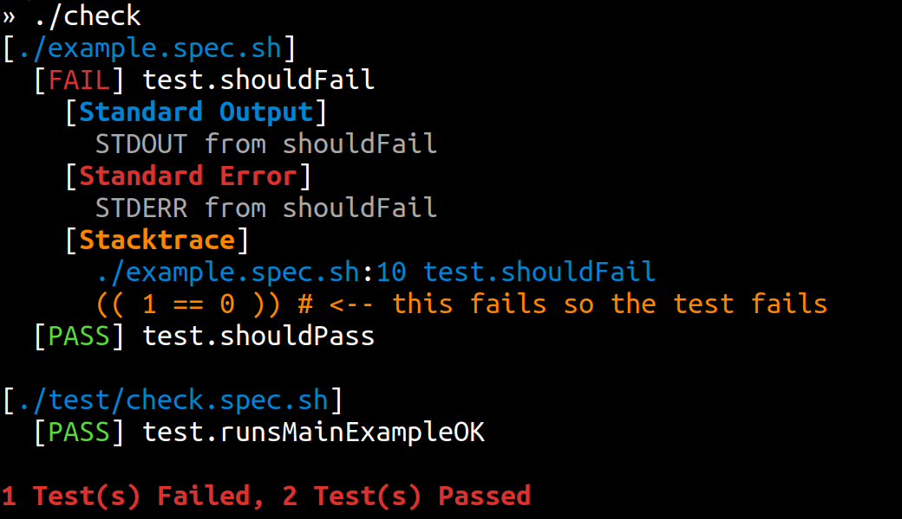

[/badge.svg)](https://github.com/specs-sh/check/actions?query=workflow%3A%22Mac+%28BASH+3.2%29%22) [](https://github.com/specs-sh/check/actions?query=workflow%3A%22BASH+4.0%22) [](https://github.com/specs-sh/check/actions?query=workflow%3A%22BASH+4.4%22) [](https://github.com/specs-sh/check/actions?query=workflow%3A%22BASH+5.0%22)

# ☑️ `$ check`

> Tiny Shell Script Test Framework ( < 50 LOC)

---

`$ ./check` is a _very tiny_ but flexible testing library for shell scripts.



---

- Supports Mac OS X default BASH version (`3.2.57`)
- Supports modern BASH versions (`4.0`, `4.4`, `5.0`)
- `49 LOC` _which are jam-packed with functionality!_

---

### Example Test

```sh
setup() {
  # Some setup code that runs before each test
}

teardown() {
  # Some code that runs after each test, even if it fails
}

test.shouldPass() {
  echo "STDOUT from shouldPass"
  echo "STDERR from shouldPass" >&2
  (( 1 == 1 ))
}

test.shouldFail() {
  echo "STDOUT from shouldFail"
  echo "STDERR from shouldFail" >&2
  (( 1 == 0 )) # <-- this fails so the test fails
  (( 1 == 1 )) # <-- even though the final result passes
}
```

> By default, `check` tests fail if _any statement fails_ (_using `set -e`_)

---
