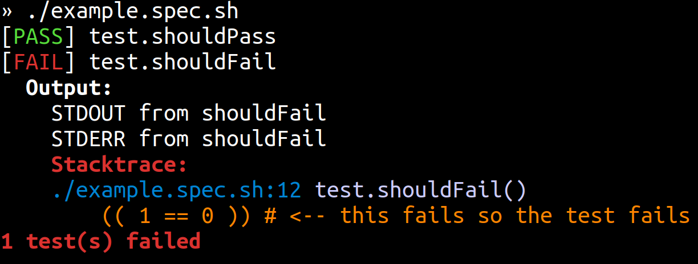

# 🧫 MicroSpec

> BASH Testing Framework _so tiny you can copy/paste it into your test files!_

---

## 8 Lines of Code

Just put this at the bottom of any test file:

```sh
test.shouldPass() {
  (( 42 == 42 ))
}

test.shouldFail() {
  (( 1 == 0 ))
}

# Copy/paste the 8 lines of code below:
for testFn in $( declare -pF | awk '{ print $3 }' | grep ^test | sort -R ); do
  output="$( [ -z "${BEFORE_TEST+x}" ] && set -eE || eval "$BEFORE_TEST"; $testFn 2>&1 )"
  case $? in
    0) echo -e "[\e[32mPASS\e[0m] $testFn"; [ "$VERBOSE" = true ] && printf '%s\n%s\n' Output: "$output" ;;
    *) echo -e "[\e[31mFAIL\e[0m] $testFn"; anyFailed=$(( anyFailed = anyFailed + 1 )); printf '%s\n%s\n' Output: "$output" ;;
  esac
done
[ -n "$anyFailed" ] && { echo "$anyFailed test(s) failed" >&2; exit 1; 
```

### Have multiple test files?

Copy/paste the code into a `runTests.sh` file and `source` it from your tests:

```sh
test.shouldPass() {
  (( 42 == 42 ))
}

test.shouldFail() {
  (( 1 == 0 ))
}

source runTests.sh
```

> You can copy/paste the `runTests.sh` file here in GitHub is you would like.

### That's it.

Here is the output of running the `example.spec.sh` file here in GitHub:



# Usage

- Any function which starts with `test` or `spec` is considered a test
- If a test _fails_, the _output_ will be printed (_combined STDOUT/STDERR_)
- If a test _passes_, the _output_ will not be printed (_combined STDOUT/STDERR_)
  - If you set the `VERBOSE=true` variable, passing tests will _also_ print output
- A test is considered _failed_ if any statement in the function "fails" (_returns non-zero_)
- You can set `BEFORE_TEST="command; command"` and it will be run before each test
  > By default, this is configured to `set -eE` which is what causes tests to fail  
  > if any command fails. You can disable this behavior via: `BEFORE_TEST=""`
  > To keep this behavior but use `BEFORE_TEST`, set `BEFORE_TEST="set -eE; command"`
- The tests `exit 1` if any tests failed (_after running all of the tests_)
- The tests are _run in random order_ which is a good testing convention

### Enjoy.